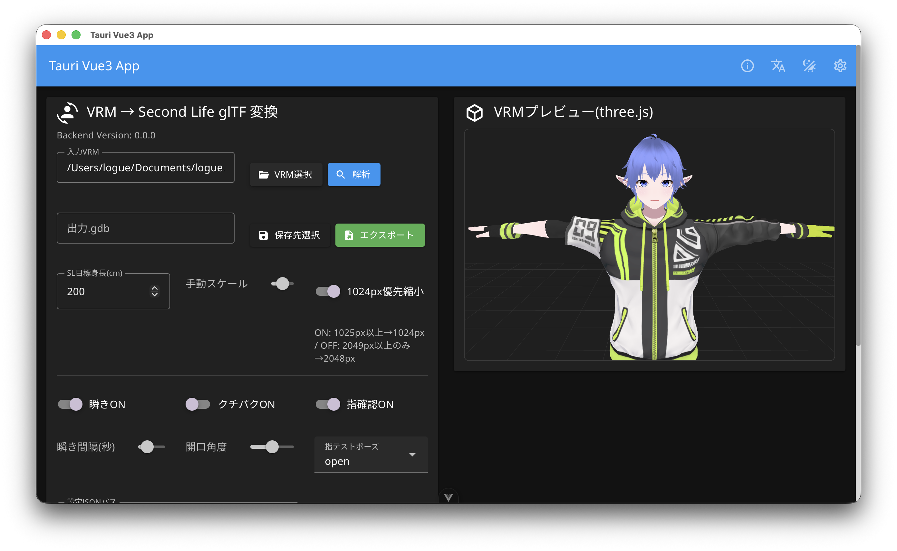

# vrm2sl



VRM to SecondLife Avatar bone converter.

## Usage

```bash
cargo run --manifest-path backend/Cargo.toml --bin vrm2sl -- input.vrm output.gdb
```

or after install/build:

```bash
cargo install --path backend --bin vrm2sl
vrm2sl input.vrm output.gdb
```

### Analyze only (no export)

```bash
vrm2sl input.vrm output.gdb --analyze-only --report report.json
```

When analysis or conversion completes, a desktop notification is sent (on macOS, via `osascript`).

### Main options

- `--target-height <cm>`: target avatar height (default `200`)
- `--manual-scale <n>`: extra scale multiplier (default `1.0`)
- `--resize on|off`: texture auto-resize policy (default `on`)
- `--resize-method bilinear|nearest|bicubic|gaussian|lanczos3`
- `--load-settings <project.json>`: load project settings
- `--save-settings <project.json>`: save current project settings
- `--report <report.json>`: save analysis report JSON

## Tauri IPC integration layer

The Rust side exposes IPC-friendly functions designed for easy integration with Tauri `invoke`.

- `ipc::analyze_vrm_ipc`
- `ipc::convert_vrm_to_gdb_ipc`
- `ipc::save_project_settings_ipc`
- `ipc::load_project_settings_ipc`

Each function accepts `String` paths and serializable request structs,
with input/output shapes that can be called directly from the UI layer.

## Tauri + Vuetify app (integrated)

`tauri-vuetify-starter` is integrated into this repository.

- Frontend: `frontend/`
- Tauri backend: `backend/`
- Rust core implementation: `backend/src/`

### Desktop app run

```bash
pnpm install
pnpm dev:tauri
```

From `MainContent` in the UI, you can:

- Select a VRM file
- Run analysis (bones/vertices/textures/upload cost estimate)
- Save/load settings JSON
- Export `.gdb`

Desktop notifications are sent when analysis/conversion completes.

## Implemented (core MVP baseline)

- VRM/GLB input loading
- VRoid model validation (non-VRM/unsupported source is rejected)
- Required humanoid bone presence check
- Required humanoid parent-child hierarchy validation
- VRM → Second Life bone-name mapping for core humanoid bones
- Uniform avatar scaling toward SL default height (200cm)
- Mesh statistics (vertices/polygons) and 65535 vertex-limit diagnostics
- Texture resolution diagnostics and upload-fee estimate (before/after resize)
- Removal of VRM extension references/extras from output JSON chunk
- Removal of animation and morph target entries
- Project settings JSON load/save API
- Output `.gdb` (GLB container) generation

## Notes

- Current implementation focuses on Rust core pipeline and CLI.
- Texture auto-resize currently affects validation/estimation and option handling; embedded image payload rewrite is not yet enabled.
- Full hierarchy reconstruction, inverse-bind full regeneration/writeback, and advanced UI/preview workflow are planned next steps.

## Animation Attribution

Contains animation data © Linden Research, Inc.  
Licensed under CC BY 3.0  
https://creativecommons.org/licenses/by/3.0/

Modified for use in this tool.

Frontend-side asset note: see [frontend/README.md](frontend/README.md).

See [Contributing](CONTRIBUTING.md) for development and coding conventions.

## Testing

- Run tests with `cargo test`.
- Name unit tests in Given/When/Then style for behavior clarity.
- Example pattern: `given_condition_when_action_then_expected_result`.
